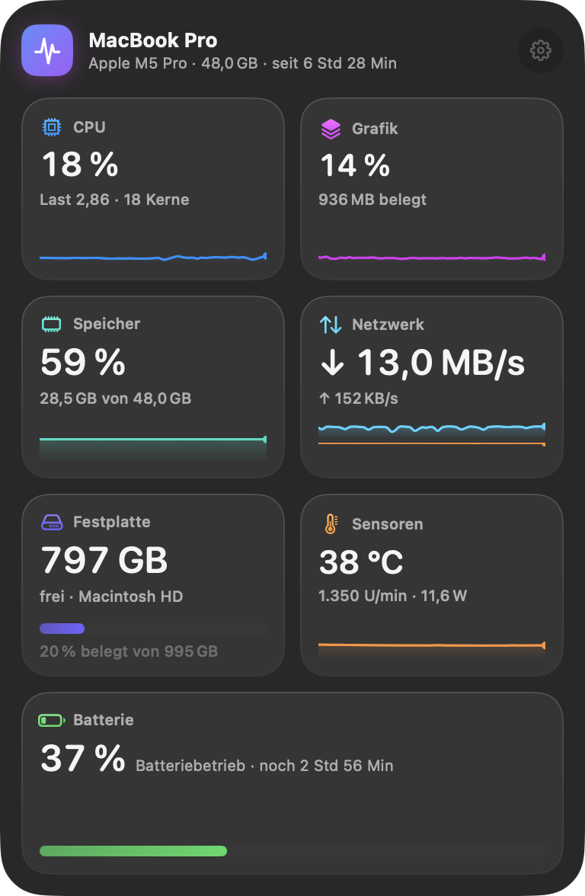
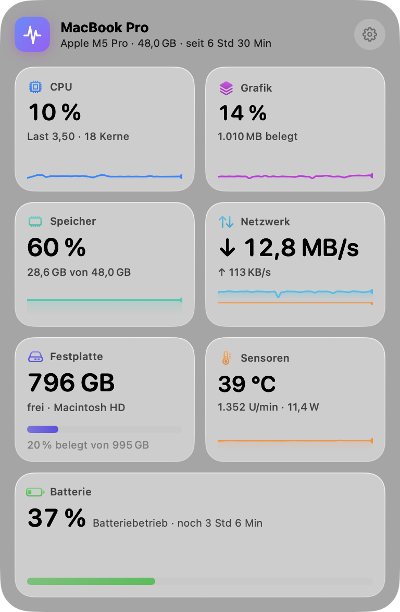
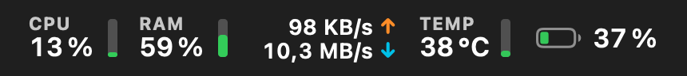
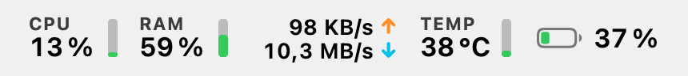
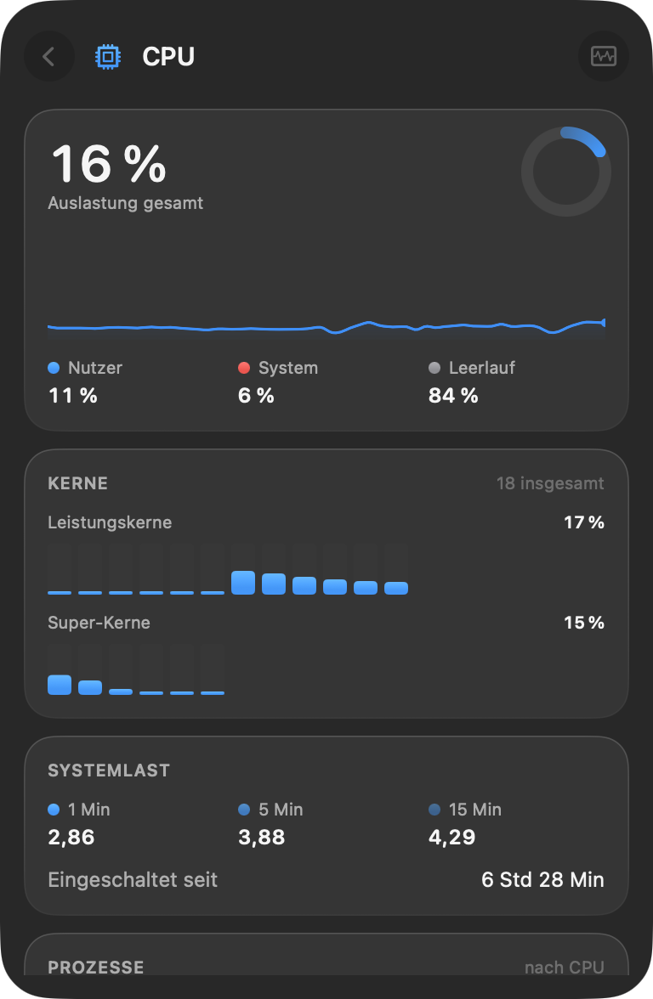
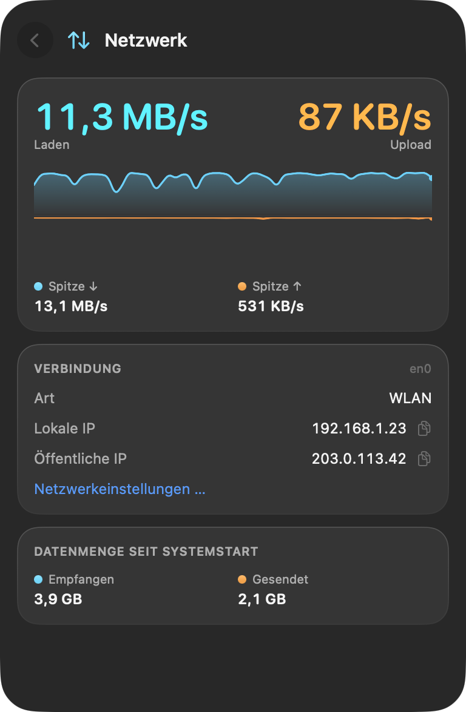
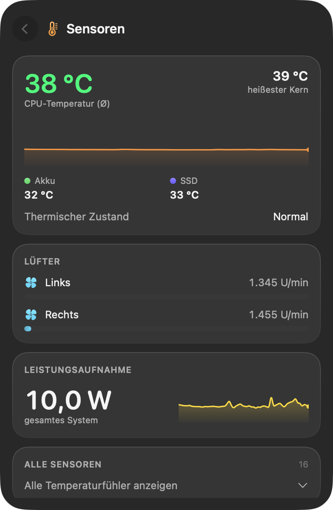

  

<h1 align="center">Puls</h1>

  Ein schlanker Systemmonitor für die macOS-Menüleiste, im Liquid-Glass-Design von macOS 26. 
  Inspiriert von iStat Menus, aber bewusst einfacher: ein Symbol, ein Panel, alles Wichtige auf einen Blick.

  <a href="https://github.com/QVllasa/puls/releases/latest"><b>⬇︎ Puls herunterladen</b></a> ·
  <a href="https://qvllasa.github.io/puls/de/">Webseite</a> ·
  macOS 26 Tahoe · Apple Silicon &amp; Intel · Deutsch &amp; Englisch · kostenlos &amp; Open Source (MIT)

<a href="README.md">English</a>

  
  

## Was Puls kann

| Bereich | In der Übersicht | In der Detailansicht |
|---|---|---|
| **CPU** | Auslastung, Verlauf | Nutzer/System/Leerlauf, jeder Kern nach Kerntyp, Systemlast 1/5/15 Min, Laufzeit, Top-Prozesse |
| **Grafik** | GPU-Auslastung, Verlauf | Renderer-Last, Grafikspeicher, GPU-Kerne, GPU-Temperatur |
| **Speicher** | Belegung, Verlauf | App-, fester und komprimierter Speicher, Cache, Speicherdruck, Swap, Top-Prozesse |
| **Netzwerk** | Download/Upload live | Gespiegelter Verlauf, Spitzen, WLAN/Ethernet, lokale und öffentliche IP (Klick kopiert), Datenmenge seit Start |
| **Festplatte** | Freier Speicher | Lesen/Schreiben live, alle Volumes (Klick öffnet im Finder) |
| **Sensoren** | CPU-Temperatur, Lüfter, Watt | Ø- und Höchsttemperatur, Grafik/Akku/SSD, Lüfter, Leistungsaufnahme, alle Fühler |
| **Batterie** | Ladestand, Restlaufzeit | Maximale Kapazität, Ladezyklen, Temperatur, Lade-/Entladeleistung, Netzteil, AirPods / Magic-Zubehör |

**Menüleiste:** frei wählbar, mit farbigen Ampel-Indikatoren oder einfarbig.

   
  

  
  
  

## GitHub-Version oder Mac App Store?

| | GitHub | Mac App Store |
|---|---|---|
| Preis | kostenlos | kostenlos |
| CPU, GPU, Speicher, Netzwerk, Festplatte, Batterie | ✓ | ✓ |
| CPU- und Chip-Temperaturen, Lüfter | ✓ | nein (von der Sandbox blockiert) |
| Top-Prozesse | ✓ | nein (von der Sandbox blockiert) |
| AirPods-Akkustände | ✓ | nein |
| Thermischer Zustand, Leistungsaufnahme, Akku-Temperatur | ✓ | ✓ |
| Updates | Hinweis in der App, Download von GitHub | automatisch über den App Store |
| Signatur | Developer ID, von Apple beglaubigt | App Store |

Bitte nur eine der beiden installieren; beide heißen „Puls“.

## Installation

1. `Puls-x.y.z.zip` aus dem [neuesten Release](https://github.com/QVllasa/puls/releases/latest) laden, entpacken und `Puls.app` in **Programme** ziehen.
2. Öffnen. Puls erscheint oben rechts in der Menüleiste.

Voraussetzung: **macOS 26 (Tahoe)** oder neuer.

## Datenschutz

Puls sammelt nichts. Alle Werte werden lokal gelesen. Einzige Netzwerkanfragen: Die GitHub-Version fragt einmal täglich bei api.github.com nach einer neuen Version (abschaltbar), und nur wenn du es einschaltest, ruft Puls deine öffentliche IP über [api.ipify.org](https://www.ipify.org) ab. [Datenschutzerklärung](https://qvllasa.github.io/puls/de/datenschutz.html).

## Selbst bauen, Technik, Lizenz

Siehe die [englische README](README.md#build-it-yourself). Lizenz: [MIT](LICENSE).
