<p align="center">
  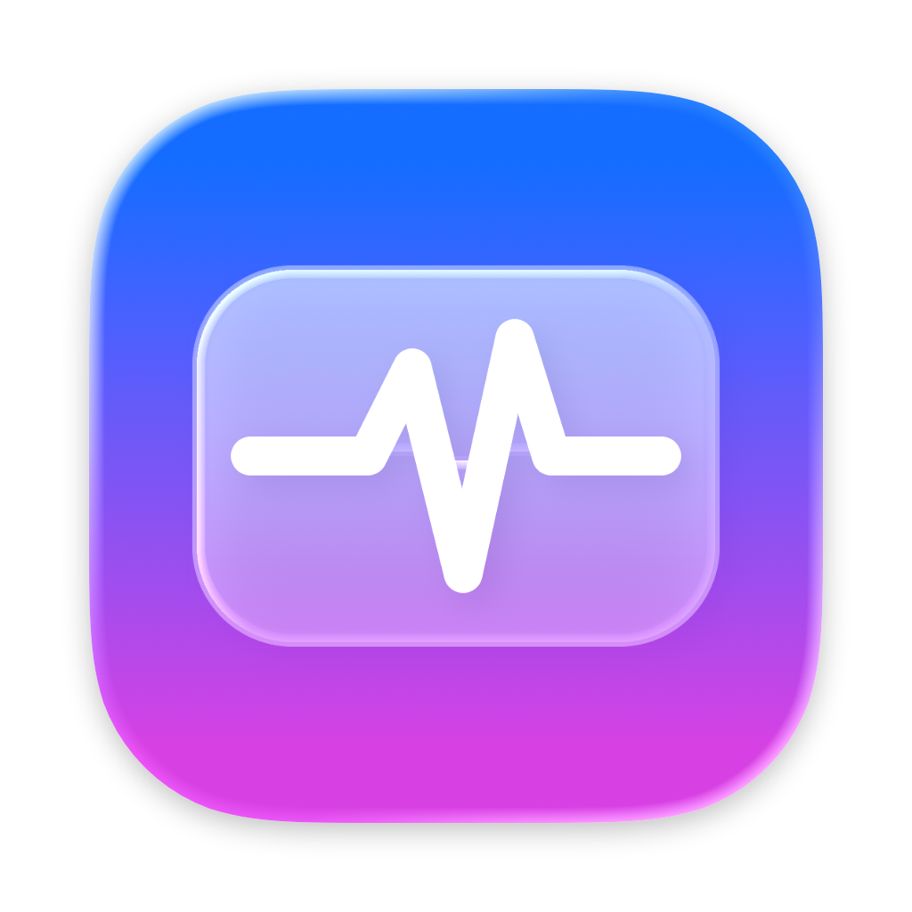
</p>

<h1 align="center">Puls</h1>

<p align="center">
  A lightweight system monitor for the macOS menu bar – in the Liquid Glass design of macOS 26.<br>
  Inspired by iStat Menus, but deliberately simpler: one menu bar item, one panel, everything important at a glance.
</p>

<p align="center">
  <a href="https://github.com/QVllasa/puls/releases/latest"><b>⬇︎ Download Puls</b></a> ·
  <a href="https://qvllasa.github.io/puls/">Website</a> ·
  macOS 26 Tahoe · Apple silicon &amp; Intel · English &amp; German · free &amp; open source (MIT)
</p>

<p align="center">
  <a href="https://github.com/QVllasa/puls/actions/workflows/ci.yml"></a>
  · <a href="README.de.md">Deutsch</a>
</p>

<p align="center">
  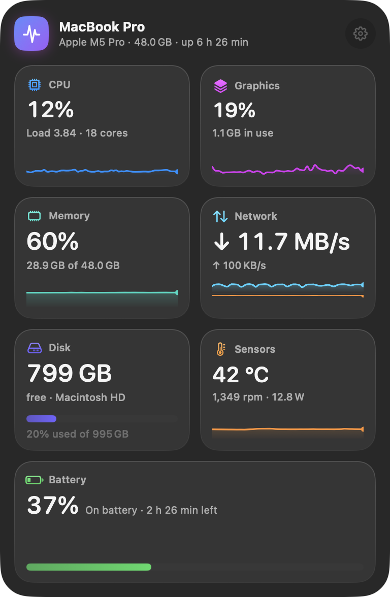
  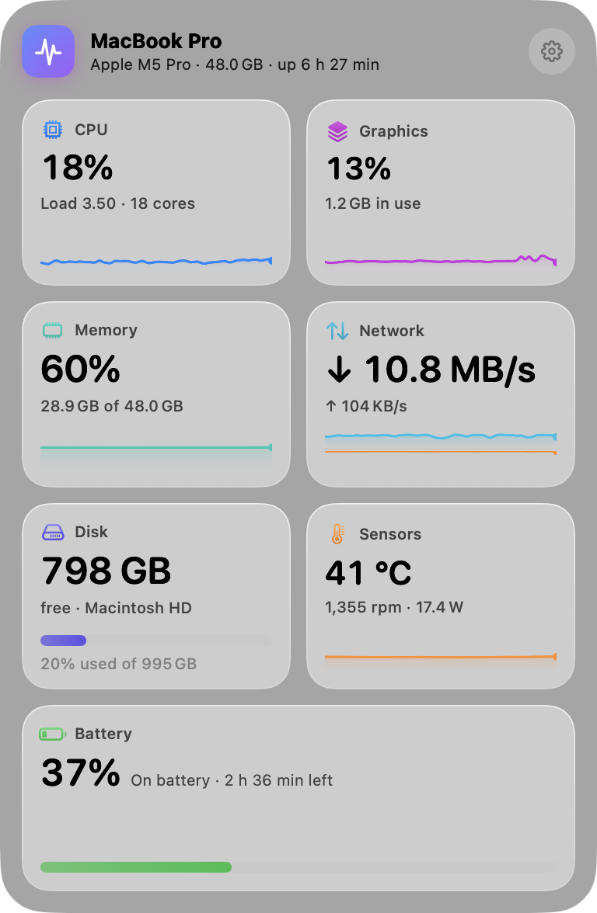
</p>

## What Puls shows

| Area | In the overview | In the details |
|---|---|---|
| **CPU** | Load, history | User/system/idle, every core grouped by core type, system load 1/5/15 min, uptime, top processes |
| **Graphics** | GPU utilization, history | Renderer load, graphics memory, GPU cores, GPU temperature |
| **Memory** | Usage, history | App, wired and compressed memory, cache, memory pressure, swap, top processes |
| **Network** | Live download/upload | Mirrored history, peaks, Wi-Fi/Ethernet, local and public IP (click to copy), data since startup |
| **Disk** | Free space | Live read/write, all volumes with usage (click to open in Finder) |
| **Sensors** | CPU temperature, fans, watts | Average and hottest core, graphics/battery/SSD, fan speeds, system power draw, all sensors |
| **Battery** | Charge, time remaining | Maximum capacity, cycle count, temperature, charging/discharging power, adapter, AirPods / Magic accessories |

**Menu bar:** choose what appears at the top (CPU, graphics, memory, network, disk, temperature, battery) – with colored status indicators that turn yellow or red under load, or plain monochrome.

<p align="center">
  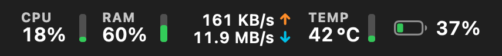<br>
  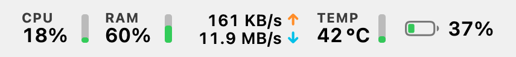
</p>

<p align="center">
  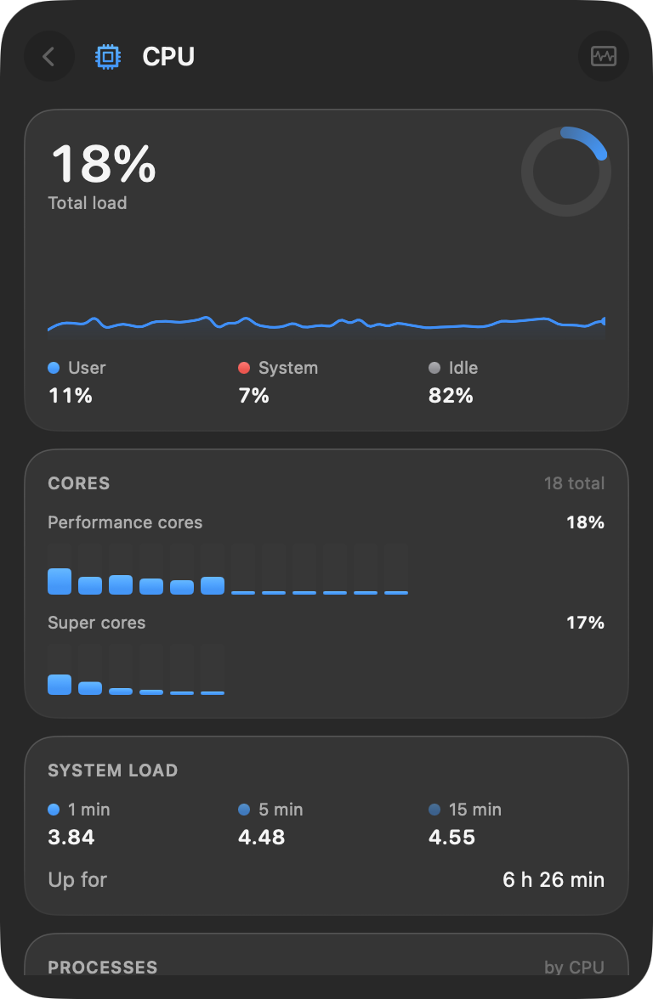
  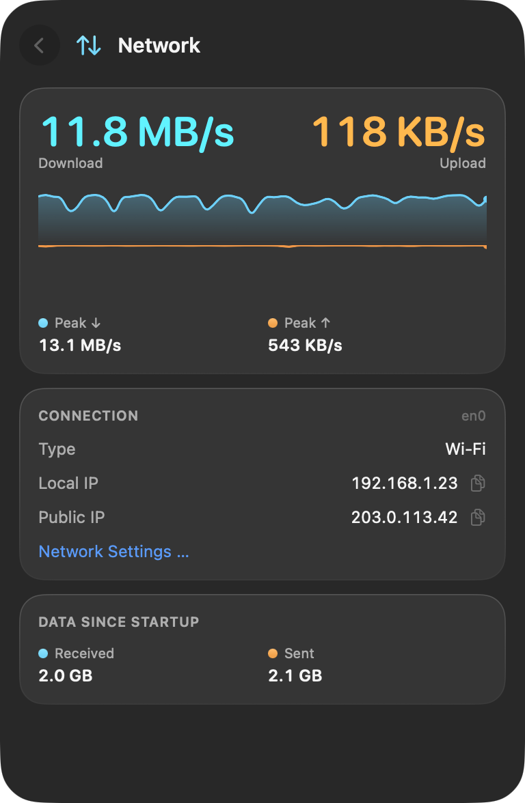
  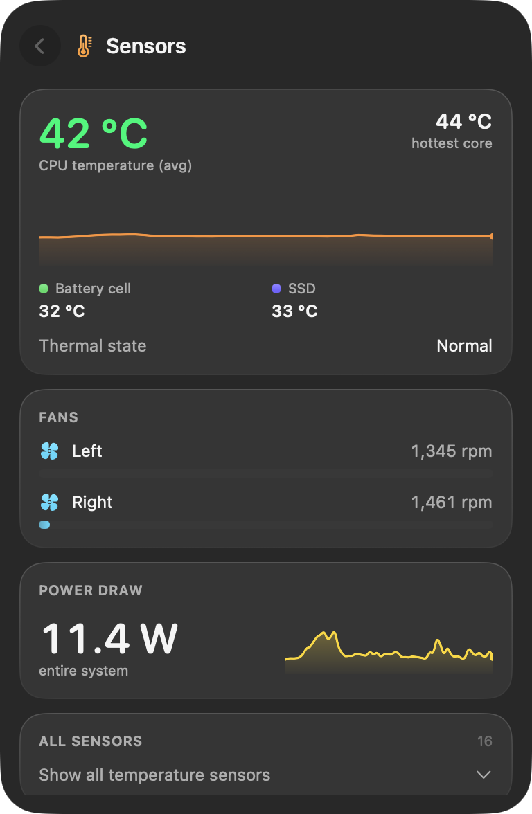
</p>
<p align="center">
  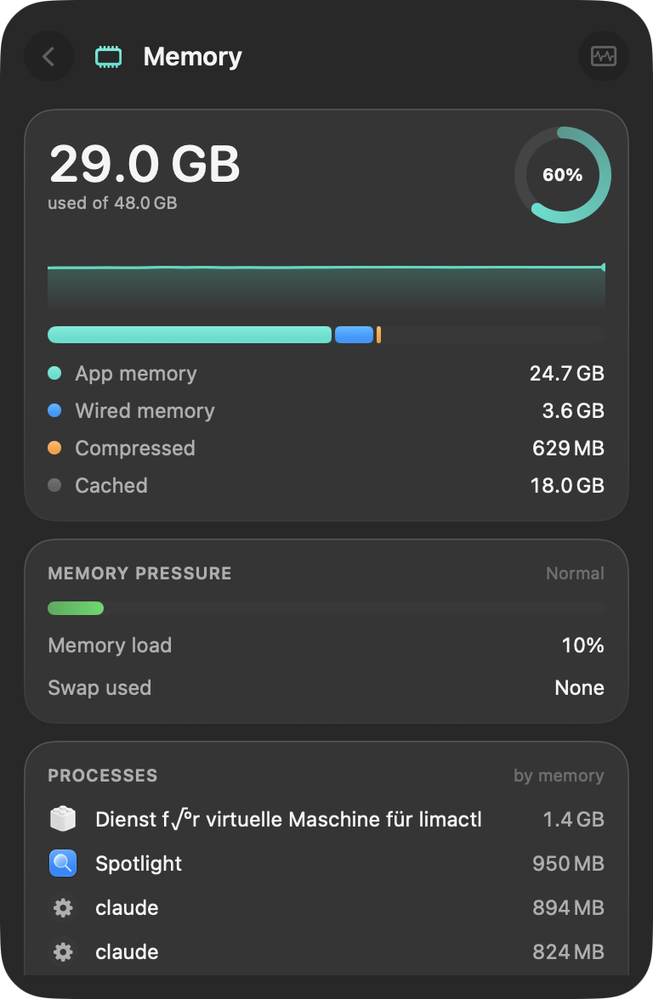
  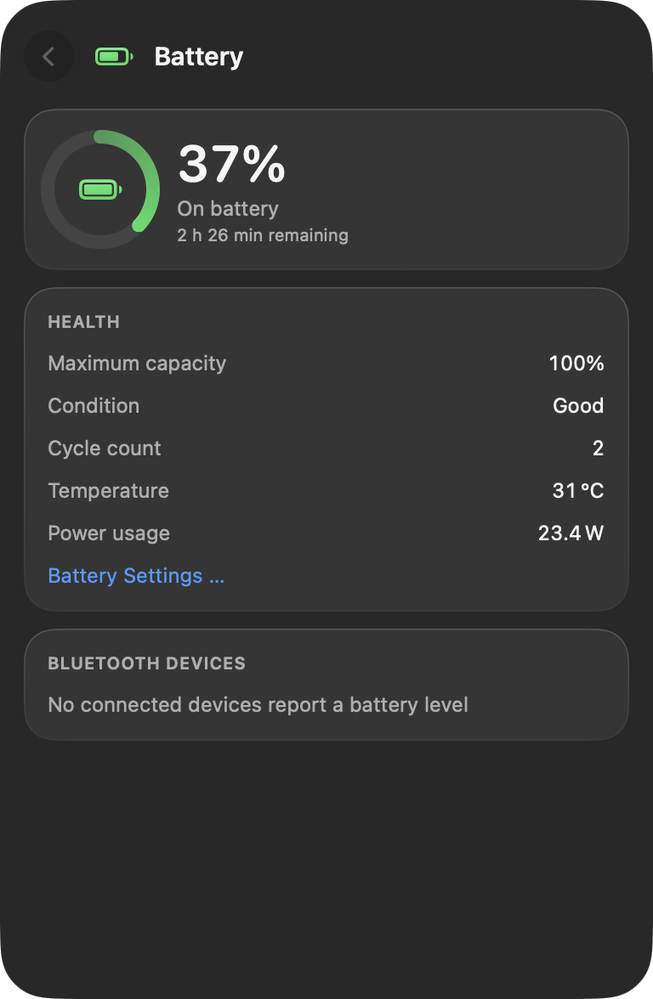
  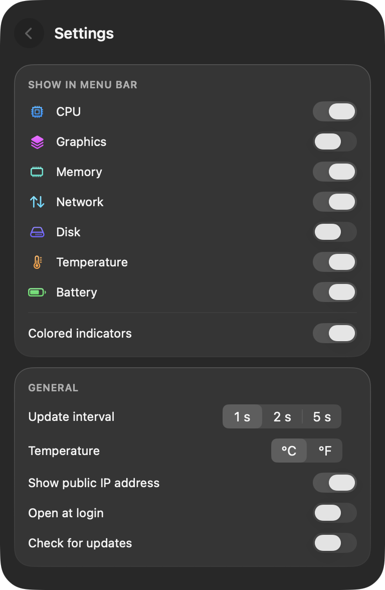
</p>

## GitHub version or Mac App Store?

| | GitHub (this repo) | Mac App Store |
|---|---|---|
| Price | free | free |
| CPU / GPU / memory / network / disk / battery | ✓ | ✓ |
| CPU & chip temperatures, fan speeds | ✓ | – (not allowed in the App Sandbox) |
| Top processes | ✓ | – (not allowed in the App Sandbox) |
| AirPods battery levels | ✓ | – |
| Thermal state, power draw, battery temperature | ✓ | ✓ |
| Updates | in-app notice, download from GitHub | automatic via the App Store |
| Code signing | Developer ID, notarized by Apple | App Store |

Please install only one of them – both are called “Puls”.

## Usage

- **Click** the menu bar item to open the glass panel; click a tile for details.
- **Right-click** for a small menu (settings, Activity Monitor, quit).
- **Esc** or a click elsewhere closes the panel.
- The GitHub version starts with your Mac from the first launch; the App Store version asks first. Both can be changed in Settings.

## Installation

1. Download `Puls-x.y.z.zip` from the [latest release](https://github.com/QVllasa/puls/releases/latest), unzip it and drag `Puls.app` into **Applications**.
2. Open it. Puls appears in the top-right of the menu bar.

Requires **macOS 26 (Tahoe)** or later.

## Privacy

Puls collects nothing. All values are read locally. The only network requests: once a day the GitHub version asks api.github.com for a newer release (can be turned off), and – only if you enable it – Puls looks up your public IP via [api.ipify.org](https://www.ipify.org). Full policy: [privacy](https://qvllasa.github.io/puls/privacy.html).

## Build it yourself

The Command Line Tools are enough (`xcode-select --install`); Xcode is only needed to recompile the app icon.

```sh
git clone https://github.com/QVllasa/puls.git && cd puls
swift build                      # development build
scripts/test.sh                  # unit tests (also works without Xcode)
.build/debug/Puls --dump         # print all readings (diagnostics)
scripts/build-app.sh             # universal app in dist/Puls.app + ZIP
```

Every push is built and tested on Apple silicon and Intel by [GitHub Actions](.github/workflows/ci.yml).

| Script | Purpose |
|---|---|
| `scripts/build-app.sh` | GitHub version: universal app, signed and notarized (if a Developer ID is available), ZIP |
| `scripts/build-appstore.sh` | App Store version (`-DAPPSTORE`): sandboxed, no private APIs, signed `.pkg` |
| `scripts/asc_submit.py` | App Store Connect: metadata, screenshots, upload, submission via the official API |
| `scripts/compile-icon.sh` | Compiles the Liquid Glass icon (`Resources/AppIcon.icon`) with `actool` |
| `scripts/gen-strings.py` | Generates the English/German string tables from `Resources/l10n/de.json` |

## How it works

Puls reads everything directly from macOS, without helper tools or administrator rights:

- **CPU** via `host_processor_info`, core types via `hw.perflevel*`
- **Memory** via `host_statistics64` (same formula as Activity Monitor), memory pressure via `kern.memorystatus_*`
- **GPU** via the IOAccelerator `PerformanceStatistics`
- **Network** via 64-bit counters (`NET_RT_IFLIST2`) of the primary interface
- **Disk** via `IOBlockStorageDriver` statistics
- **Temperatures** via IOHIDEventSystem (Apple silicon), **fans & power** via the SMC (GitHub version only)
- **Battery** via IOPowerSources and `AppleSmartBattery`, system power via its power telemetry
- **Bluetooth batteries** via `system_profiler` and IOKit; **processes** via `ps`

Tested on MacBook Pro M2 Pro and M5 Pro, and on Intel in CI.

## License

[MIT](LICENSE) – you may use, modify and share Puls freely.
