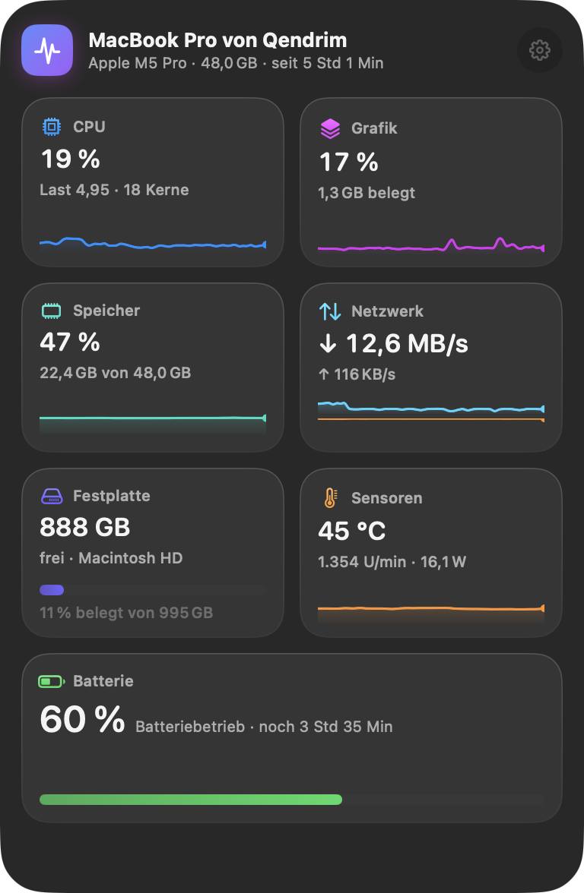
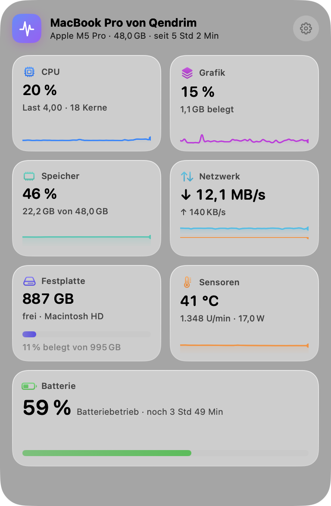
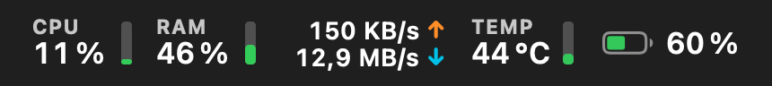
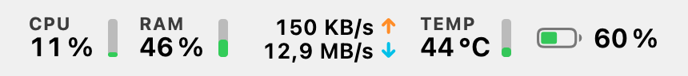
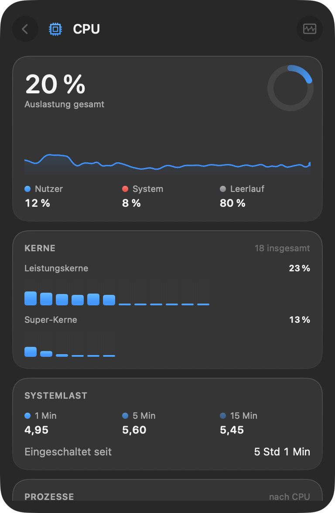
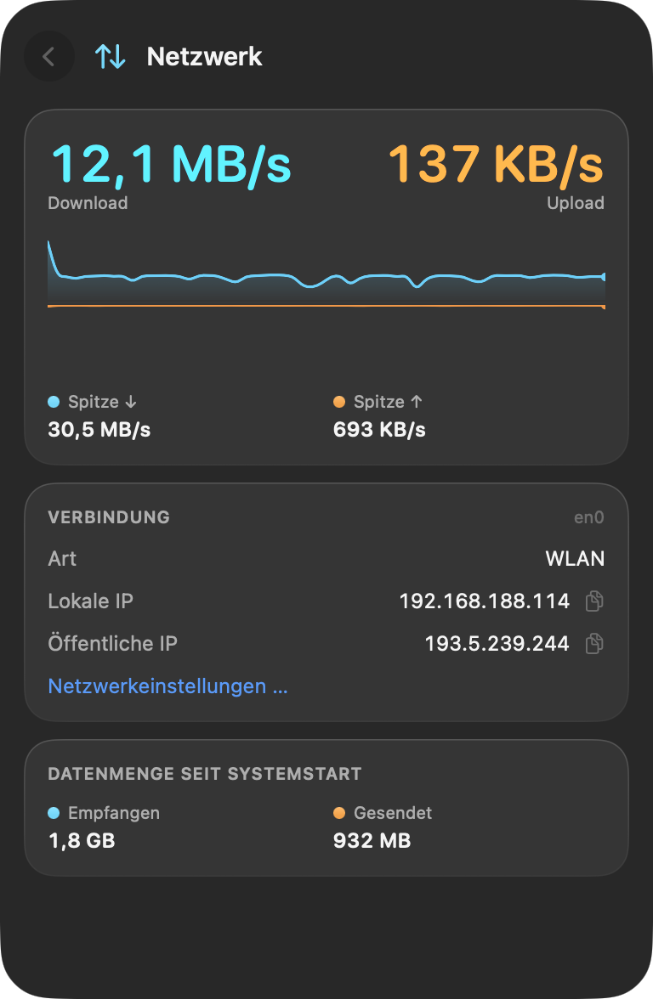
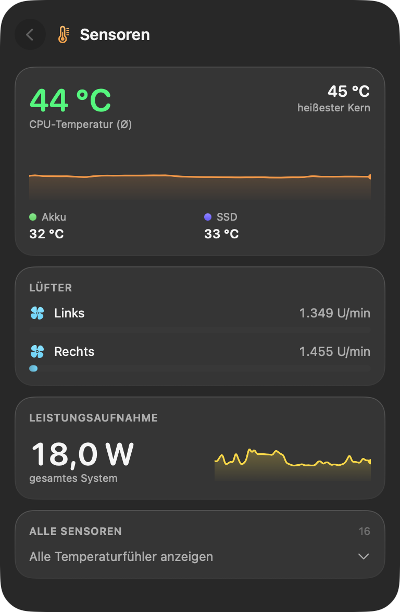
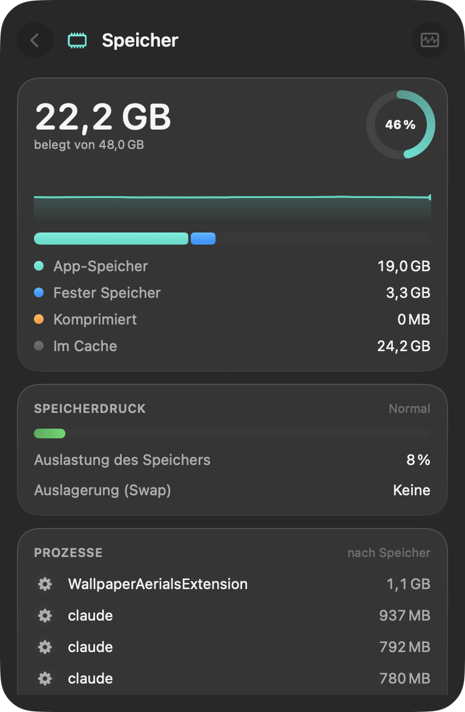
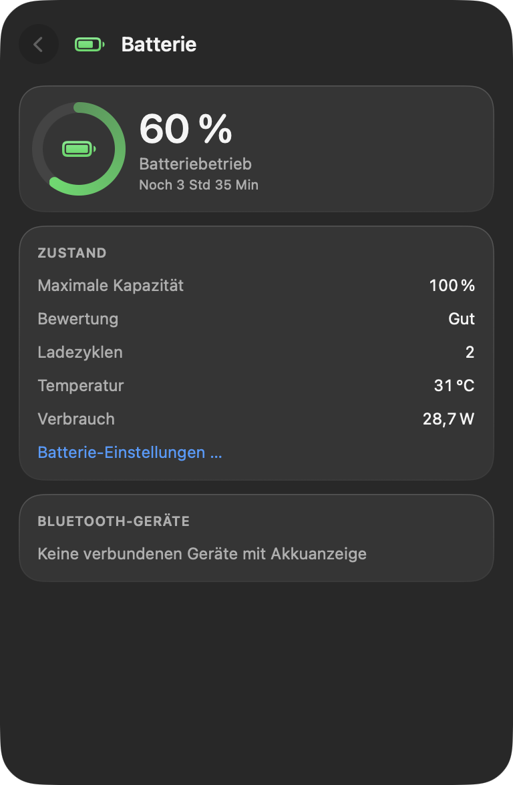
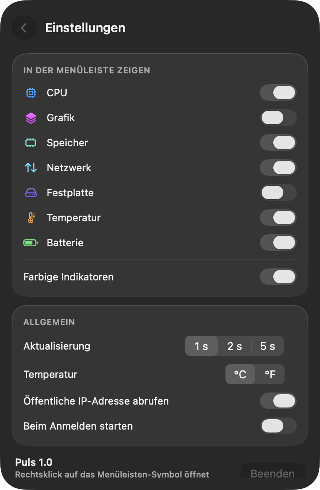

<p align="center">
  
</p>

<h1 align="center">Puls</h1>

<p align="center">
  Ein schlanker Systemmonitor für die macOS-Menüleiste – im Liquid-Glass-Design von macOS 26.<br>
  Inspiriert von iStat Menus, aber bewusst einfacher: ein Symbol, ein Panel, alles Wichtige auf einen Blick.
</p>

<p align="center">
  <a href="https://github.com/QVllasa/puls/releases/latest"><b>⬇︎ Puls herunterladen</b></a> ·
  macOS 26 Tahoe · Apple Silicon &amp; Intel · kostenlos &amp; Open Source (MIT)
</p>

<p align="center">
  
  
</p>

## Was Puls kann

| Bereich | In der Übersicht | In der Detailansicht |
|---|---|---|
| **CPU** | Auslastung, Verlauf | Nutzer/System/Leerlauf, jeder Kern einzeln (nach Kerntyp gruppiert), Systemlast 1/5/15 Min, Laufzeit, Top-Prozesse |
| **Grafik** | GPU-Auslastung, Verlauf | Renderer-Last, belegter Grafikspeicher, GPU-Kerne, GPU-Temperatur |
| **Speicher** | Belegung, Verlauf | App-Speicher, fester Speicher, komprimiert, Cache, Speicherdruck, Swap, Top-Prozesse |
| **Netzwerk** | Download/Upload live | Gespiegelter Verlauf, Spitzenwerte, WLAN/Ethernet, lokale und öffentliche IP (Klick kopiert), Datenmenge seit Start |
| **Festplatte** | Freier Speicher | Lesen/Schreiben live, alle Volumes mit Belegung (Klick öffnet im Finder) |
| **Sensoren** | CPU-Temperatur, Lüfter, Watt | Ø- und Höchsttemperatur, Grafik/Akku/SSD, Lüfterdrehzahlen, Leistungsaufnahme des Systems, alle Fühler |
| **Batterie** | Ladestand, Restlaufzeit | Zustand (max. Kapazität), Ladezyklen, Temperatur, Lade-/Entladeleistung, Netzteil, Akkus von AirPods, Magic Keyboard, Maus & Co. |

**Menüleiste:** Frei wählbar, was oben angezeigt wird (CPU, Grafik, Speicher, Netzwerk, Festplatte, Temperatur, Batterie) – mit farbigen Ampel-Indikatoren, die bei hoher Last gelb bzw. rot werden, oder schlicht einfarbig.

<p align="center">
  <br>
  
</p>

<p align="center">
  
  
  
</p>
<p align="center">
  
  
  
</p>

## Bedienung

- **Klick** auf das Menüleisten-Symbol öffnet das Glas-Panel, ein Klick auf eine Kachel die Details.
- **Rechtsklick** öffnet ein kleines Menü (Einstellungen, Aktivitätsanzeige, Beenden).
- **Esc** oder ein Klick daneben schließt das Panel.
- Puls startet beim ersten Öffnen automatisch mit dem Mac (in den Einstellungen abschaltbar).

## Installation

1. [`Puls-x.y.z.zip` aus dem neuesten Release](https://github.com/QVllasa/puls/releases/latest) laden, entpacken und `Puls.app` in den Ordner **Programme** ziehen.
2. Puls ist frei verteilt und nicht bei Apple notariell beglaubigt. Beim ersten Start meldet macOS deshalb, dass die App nicht überprüft werden konnte. So öffnest du sie trotzdem:
   - **Systemeinstellungen → Datenschutz & Sicherheit →** ganz unten bei „Puls wurde blockiert“ auf **Trotzdem öffnen** klicken, **oder**
   - im Terminal: `xattr -dr com.apple.quarantine /Applications/Puls.app`
3. Puls erscheint oben rechts in der Menüleiste. Fertig.

Voraussetzung ist **macOS 26 (Tahoe)** oder neuer, weil Puls das neue Liquid-Glass-Material nutzt.

## Datenschutz

Puls sammelt nichts und sendet nichts. Die einzige Netzwerkanfrage ist das Abrufen der eigenen öffentlichen IP-Adresse über [api.ipify.org](https://www.ipify.org) – höchstens alle 5 Minuten, nur solange das Panel offen ist, und in den Einstellungen abschaltbar.

## Selbst bauen

Es reichen die Command Line Tools (`xcode-select --install`), Xcode ist nicht nötig.

```sh
git clone https://github.com/QVllasa/puls.git && cd puls
swift build                      # Entwicklungs-Build
.build/debug/Puls --dump         # alle Messwerte als Text ausgeben (Diagnose)
scripts/build-app.sh             # Universal-App nach dist/Puls.app + ZIP
```

`--snapshot <ordner> [--light] [--warmup <sek>]` erzeugt die Screenshots dieser Seite.

## Wie es funktioniert

Puls liest alle Werte direkt aus macOS, ohne Hilfsprogramme und ohne Administratorrechte:

- **CPU** über `host_processor_info`, Kerntypen über `hw.perflevel*`
- **Speicher** über `host_statistics64` (gleiche Formel wie die Aktivitätsanzeige), Speicherdruck über `kern.memorystatus_*`
- **GPU** über die `PerformanceStatistics` des IOAccelerator-Treibers
- **Netzwerk** über 64-Bit-Zähler (`NET_RT_IFLIST2`) der primären Schnittstelle
- **Festplatte** über die Statistiken von `IOBlockStorageDriver`
- **Temperaturen** über das IOHIDEventSystem (Apple Silicon), **Lüfter & Leistung** über den SMC
- **Batterie** über IOPowerSources und `AppleSmartBattery`, **Bluetooth-Akkus** über `system_profiler` und IOKit
- **Prozesse** über `ps`

Getestet auf MacBook Pro mit M2 Pro und M5 Pro. Auf Intel-Macs laufen alle Module, die Temperaturfühler sind dort aber eingeschränkt.

## Im Vergleich zu iStat Menus

Puls konzentriert sich auf die Systemwerte und lässt bewusst weg: Wetter, Uhrzeit/Weltzeit, Benachrichtigungen, mehrere Menüleisten-Symbole pro Modul und Dutzende Darstellungsoptionen. Dafür ist alles in einem einzigen, ruhigen Panel.

## Lizenz

[MIT](LICENSE) – du darfst Puls frei benutzen, verändern und weitergeben.

---

<details>
<summary><b>English</b></summary>

**Puls** is a lightweight system monitor for the macOS menu bar with a Liquid Glass design (macOS 26+). Think iStat Menus, simplified: one menu bar item, one glass panel with tiles for CPU, GPU, memory, network, disk, sensors (temperatures, fans, power draw) and battery (incl. AirPods / Magic accessories). Tap a tile for details. Colored traffic-light indicators in the menu bar are optional. The UI is currently German.

**Install:** download the ZIP from the [latest release](https://github.com/QVllasa/puls/releases/latest), move `Puls.app` to Applications. The app is not notarized, so allow it once via *System Settings → Privacy & Security → Open Anyway*, or run `xattr -dr com.apple.quarantine /Applications/Puls.app`.

**Build:** `swift build` (Command Line Tools are enough), `scripts/build-app.sh` for a universal app bundle.

No telemetry. The only network request fetches your public IP from api.ipify.org (can be disabled). MIT licensed.
</details>
